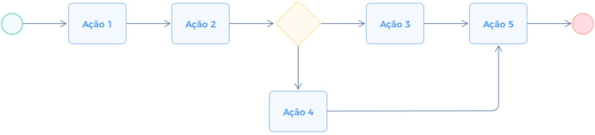

# Projeto de Interface

Pré-requisitos: <a href="2-Especificação do Projeto.md"> Documentação de Especificação</a>

Visão geral da interação do usuário pelas telas do sistema e protótipo interativo das telas com as funcionalidades que fazem parte do sistema (wireframes).

 Apresente as principais interfaces da plataforma. Discuta como ela foi elaborada de forma a atender os requisitos funcionais, não funcionais e histórias de usuário abordados nas <a href="2-Especificação do Projeto.md"> Documentação de Especificação</a>.

## Diagrama de Fluxo

O diagrama apresenta o estudo do fluxo de interação do usuário com o sistema interativo e  muitas vezes sem a necessidade do desenho do design das telas da interface. Isso permite que o design das interações seja bem planejado e gere impacto na qualidade no design do wireframe interativo que será desenvolvido logo em seguida.

O diagrama de fluxo pode ser desenvolvido com “boxes” que possuem internamente a indicação dos principais elementos de interface - tais como menus e acessos - e funcionalidades, tais como editar, pesquisar, filtrar, configurar - e a conexão entre esses boxes a partir do processo de interação. Você pode ver mais explicações e exemplos https://www.lucidchart.com/blog/how-to-make-a-user-flow-diagram.

As referências abaixo irão auxiliá-lo na geração do artefato “Diagramas de Fluxo”.

> **Links Úteis**:
> - [Fluxograma online: seis sites para fazer gráfico sem instalar nada | Produtividade | TechTudo](https://www.techtudo.com.br/listas/2019/03/fluxograma-online-seis-sites-para-fazer-grafico-sem-instalar-nada.ghtml)

## Wireframes

+ RF-001
  - A aplicação deve permitir que usuários do tipo Doador e Beneficiário realizem cadastro, login, logout e recuperação de senha.
+ RF-002
  - A aplicação deve exigir o aceite digital obrigatório do "Termo de Responsabilidade" (baseado na Lei 14.016/2020) no momento do cadastro do doador.

Login/Autenticação

Cadastro de Usuário

+ RF-003
  - A aplicação deve permitir que o usuário gerencie seu perfil, incluindo edição de dados e envio de documentos para verificação do administrador.

Perfil (Editar)

+ RF-004
  - A aplicação deve permitir que o doador cadastre itens para doação com as informações dos produtos.
+ RF-012
  - A aplicação deve permitir ao doador delimitar no item doado a quantidade que cada classe de beneficiário pode retirar do item.

Cadastro de Produto

+ RF-005
  - A aplicação deve exibir uma vitrine em tempo real das doações disponíveis, permitindo que o beneficário possa realizar filtros.

+ RF-006
  - A aplicação deve permitir que o beneficiário solicite e reserve uma doação, alterando o status do item no sistema para evitar que outra pessoa reserve o mesmo alimento.

+ RF-007
  - A aplicação deve permitir que o doador valide a entrega da doação através de um código numérico ou QR Code apresentado pelo receptor no momento da retirada.

Histórico de Doações

Detalhes da Doação

+ RF-008
  - A aplicação deve possuir um painel administrativo para moderação de conteúdo e gerenciamento de usuários.

+ RF-009
  - A aplicação deve notificar os usuários sobre aprovação ou recusa de reservas, lembretes de retirada e doações expiradas.

+ RF-010
  - A aplicação deve gerar relatórios de impacto para o doador, exibindo o volume total doado e a redução estimada de CO₂ gerada por evitar o descarte.

HomePage/Dashboard
 

Painel de Impacto Ambiental

+ RF-011
  - A aplicação deve gerar relatórios de impacto para o beneficiário, exibindo o volume total itens recebidos.

+ RF-013
  - A aplicação deve permitir que doador e receptor acessem o perfil um do outro para validação dos dados públicos.
+ RF-014
  - A aplicação deve permitir que doador e receptor avaliem um ao outro com 1 a 5 estrelas após a conclusão da retirada.

Perfil (Público)

+ RF-015
  - A aplicação deve disponibilizar um chat ou sistema de mensagens interno para comunicação direta e alinhamento entre doador e beneficiário.
Chat

